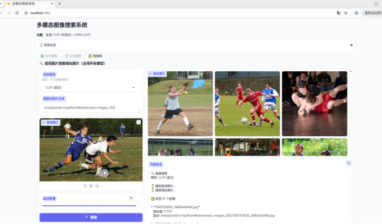
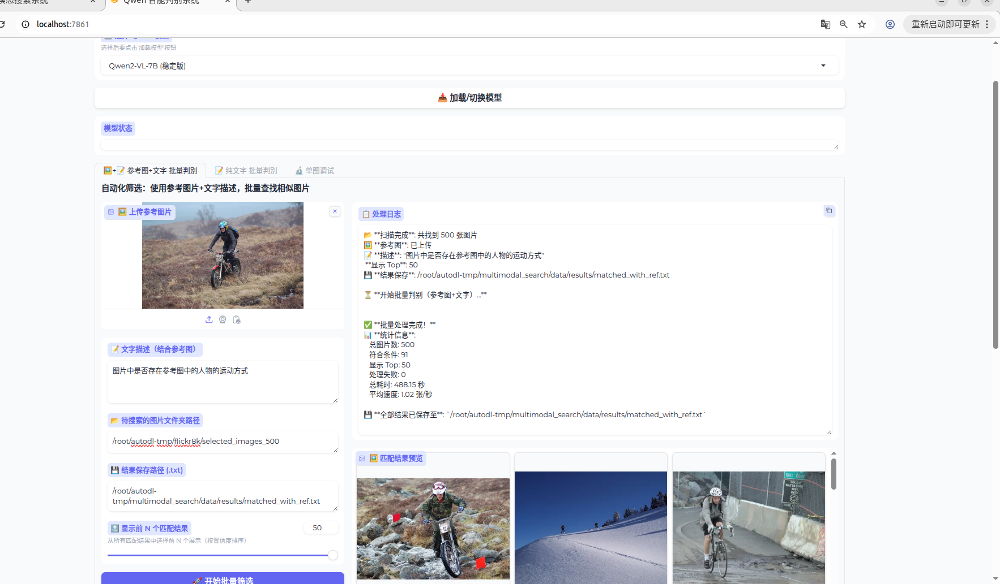

#  多模态图像检索与细粒度判别系统 (Multimodal Image Retrieval & Fine-grained Discrimination System)

一个集成了 **CLIP**、**DINOv2** 和 **Qwen2-VL** 的多模态图像检索与智能判别系统。项目结合了传统向量检索的高效性与多模态大模型的深度视觉推理能力，旨在解决大规模图像库中的语义检索以及工业/自动驾驶场景下的长尾 Bad Case 挖掘问题。

---

## ✨ 核心特性 (Core Features)

### 1. 统一向量检索系统 (Unified Vector Search)
- **多模型支持**：集成 CLIP (中/英文) 与 DINOv2 (ViT)，支持文搜图 (Text-to-Image) 与图搜图 (Image-to-Image)。
- **高效向量检索**：基于 **Faiss** 构建内积索引 (IndexFlatIP)，结合 L2 归一化实现毫秒级余弦相似度搜索。
- **智能索引缓存**：设计基于“文件夹路径+模型名”哈希的缓存机制，避免重复特征提取，大幅提升二次加载效率。
- **按需加载架构**：采用动态模型管理器，在 24GB 显存限制下实现多模型的灵活调度与显存释放。



### 2. Qwen2-VL 智能判别系统 (Intelligent Discrimination)
- **细粒度视觉推理**：突破传统检索模型的语义局限，支持复杂场景的逻辑判别（如：“镜头是否起雾”、“是否存在特定缺陷”）。
- **参考图+文字 批量筛选**：支持上传参考图并结合文字描述，对海量图片文件夹进行自动化遍历与匹配（如：“查找所有包含参考图右下角特定物体的图片”）。
- **自动化 Bad Case 挖掘**：批量处理结果自动按置信度排序，并导出结构化 TXT 报告，直接赋能数据清洗与模型迭代。

---
## 🏗️ 文件架构 (File Architecture)

```
.
multimodal_search/
├── config.py                    # 全局配置（模型路径、设备、目录等）
├── readme.md                    # 项目说明文档
├── requirements.txt             # Python 依赖
├── download_models.py           # 模型下载脚本
├── unified_search/              # 统一检索系统（CLIP/DINOv2）
│   ├── app.py                   # Gradio Web 界面
│   └── index_manager.py         # 索引管理
├── qwen_judge/                  # Qwen 判别系统
│   ├── app.py                   # Gradio Web 界面
│   ├── encoder.py               # Qwen 编码器封装
├── utils/                       # 工具模块
│   ├── model_manager.py         # 模型加载管理
│   └── faiss_utils.py           # Faiss 向量索引工具
├── models/                      # 模型文件目录
└── data/                        # 数据缓存相关目录
```

---

## 🏗️ todo 后续计划

#后续将逐步完善以下功能：
丰富模型接口，使自定义模型更加方便，不再使用transform接口

增加faiss的相似度计算方式和特征提取方式，支持更多的模型（例如convnext等），
目前的vit更加注重图片的语义信息，而convnext更加注重图片的细节
增加全局特征相似度，分块相似度的计算方式

更换更新的大模型

优化faiss检索速度，目前检索速度较慢